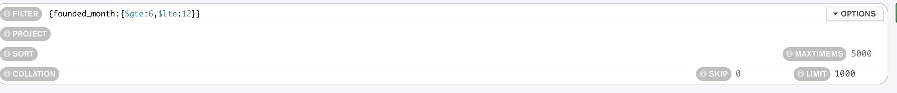

# Answers

### 1. All the companies that it's name match 'Babelgum'. Retrieve only their `name` field.

	Filter -> {name:'Babelgum'}
	Project -> {name:1}

	

<!-- Your Code Goes Here -->

### 2. All the companies that have more than 5000 employees. Limit the search to 20 companies and sort them by **number of employees**.

	Filter -> {number_of_employees: {$gte:5000}}
	Sort -> { number_of_employees: 1 }
	Limit -> 20

<!-- Your Code Goes Here -->

### 3. All the companies founded between 2000 and 2005, both years included. Retrieve only the `name` and `founded_year` fields.
	Filter -> {founded_year:{$gte:2000,$lte:2005}}
	Project -> {founded_year:1, name:1, _id:0}

<!-- Your Code Goes Here -->

### 4. All the companies that had a Valuation Amount of more than 100.000.000 and have been founded before 2010. Retrieve only the `name` and `ipo` fields.
	Filter -> {"ipo.valuation_amount":{$gte:100000000},founded_year:{$lt:2010}}  //es lt en la foto esta mal
	Project -> {ipo:1,name:1,_id:0}

<!-- Your Code Goes Here -->

### 5. All the companies that have less than 1000 employees and have been founded before 2005. Order them by the number of employees and limit the search to 10 companies.
	Filter -> {number_of_employees:{$lt:1000},founded_year:{$lt:2005}}
	Sort -> {number_of_employees:1}
	Limit -> 10

<!-- Your Code Goes Here -->

### 6. All the companies that don't include the `partners` field.

	Filter -> { partners : { "$exists" : false }}

<!-- Your Code Goes Here -->

### 7. All the companies that have a null type of value on the `category_code` field.
	Filter -> {category_code:null}

<!-- Your Code Goes Here -->

### 8. All the companies that have at least 100 employees but less than 1000. Retrieve only the `name` and `number of employees` fields.

	Filter -> {number_of_employees:{$gte:100,$lt:1000}}
	Project -> {name:1,number_of_employees:1,_id:0}

<!-- Your Code Goes Here -->

### 9. Order all the companies by their IPO price descendently.

	Sort -> {"ipo.valuation_amount":1} //es 1 en la foto esta mal

<!-- Your Code Goes Here -->

### 10. Retrieve the 10 companies with more employees, order by the `number of employees`
	Sort -> {"ipo.valuation_amount":1}
	Limit ->10

<!-- Your Code Goes Here -->

### 11. All the companies founded on the second semester of the year. Limit your search to 1000 companies.

	Filter -> {founded_month:{$gte:6,$lte:12}}
	Limit ->1000

<!-- Your Code Goes Here -->

<!-- ### 12. All the companies that have been 'deadpooled' after the third year. -->

<!-- Your Code Goes Here -->

### 12. All the companies founded before 2000 that have and acquisition amount of more than 10.000.000

	Filter -> {founded_year:{$lt:2000},"acquisition.price_amount": {$gte:10000000}}
	Limit ->1000

<!-- Your Code Goes Here -->

### 13. All the companies that have been acquired after 2010, order by the acquisition amount, and retrieve only their `name` and `acquisition` field.
	Filter -> {"acquisition.acquired_year":{$gte:2010}}
	Project ->{ "acquisition.acquired_year":1,name:1,_id:0}
	Sort -> {"acquisition.price_amount": -1}

<!-- Your Code Goes Here -->

### 14. Order the companies by their `founded year`, retrieving only their `name` and `founded year`.

	Project ->{name:1,founded_year:1,_id:0}
	Sort -> {founded_year:-1}

<!-- Your Code Goes Here -->

### 15. All the companies that have been founded on the first seven days of the month, including the seventh. Sort them by their `acquisition price` descendently. Limit the search to 10 documents.

	Filter ->{founded_day:{$gte:1,$lte:7}}
	Sort -> {"acquisition.price_amount":-1}

<!-- Your Code Goes Here -->

### 16. All the companies on the 'web' `category` that have more than 4000 employees. Sort them by the amount of employees in ascendant order.

	Filter ->{number_of_employees:{$gte:4000},category_code:{$eq:"web"}}
	Sort -> {number_of_employees:1}

<!-- Your Code Goes Here -->

### 17. All the companies which their acquisition amount is more than 10.000.000, and currency are 'EUR'.

	Filter ->{"acquisition.price_amount":{$gte:10000000}, "acquisition.price_currency_code": {$eq:"EUR"}}

<!-- Your Code Goes Here -->

### 18. All the companies that have been acquired on the first trimester of the year. Limit the search to 10 companies, and retrieve only their `name` and `acquisition` fields.
	Filter ->{founded_month:{$gte:1,$lte:3}}
	Project ->{founded_month:{$gte:1,$lte:3}}
	Limit -> 10

<!-- Your Code Goes Here -->

### 19. All the companies that have been founded between 2000 and 2010, but have not been acquired before 2011.
	Filter ->{founded_year:{$gte:2000,$lte:2010},"acquisition.acquired_year":{$lte:2011}}

<!-- Your Code Goes Here -->
